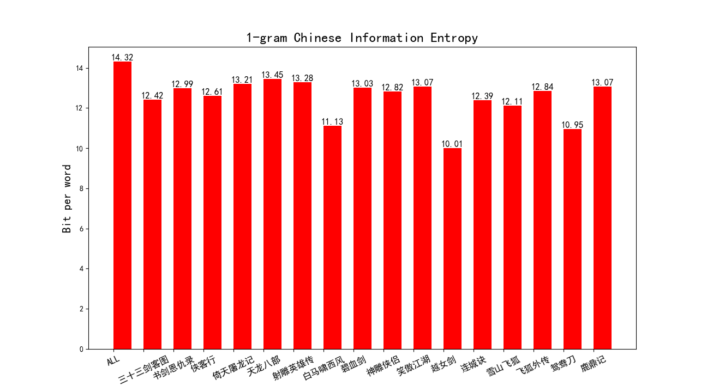
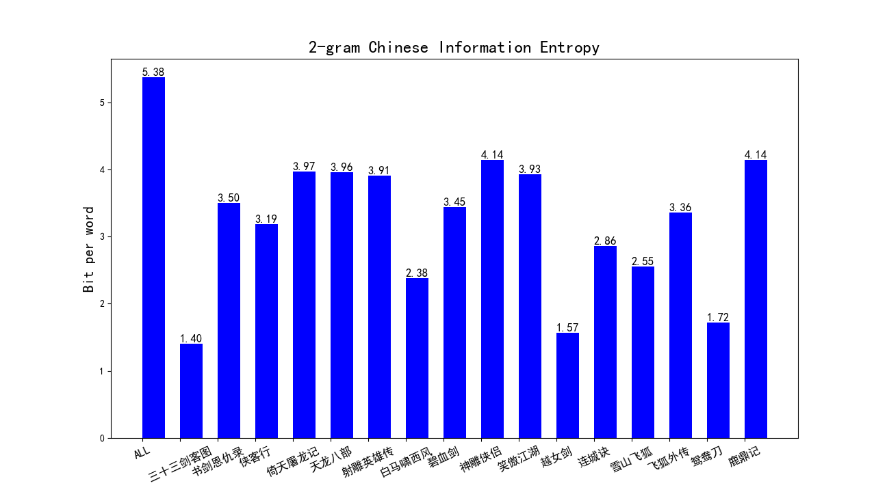
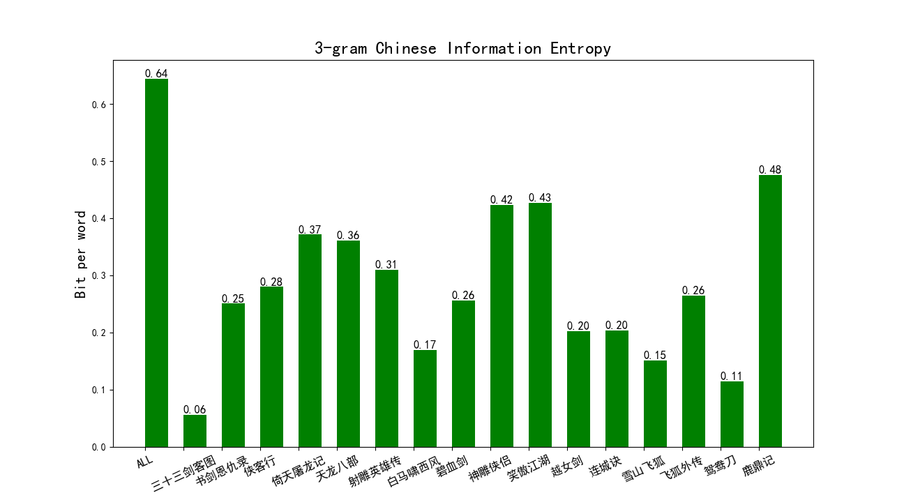
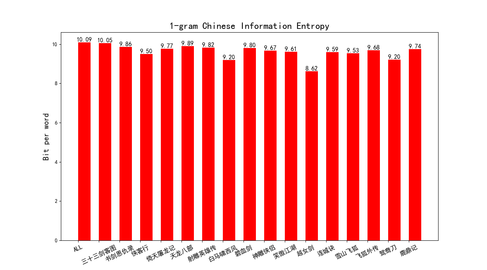
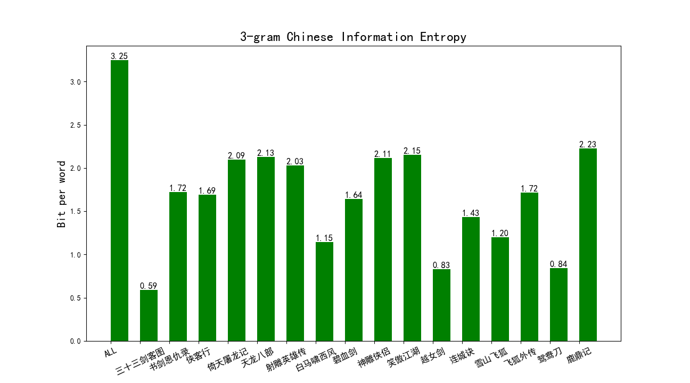

# 1. 环境配置

```python
conda create -n NLP_homework1 python=3.8
activate NLP_homework1

pip install numpy
pip install math
pip install jieba
pip install matplotlib
pip install logging
pip3 install multiprocessing
pip3 install opencc-python-reimplemented
```

# 2. 运行

```python
|--data/
|--util/
|   |——tools.py
|--CN_stopwords/
|   |--cn_stopwords.txt
|   |--cn_punctuation.txt
|--figs/
|--test.py
```


```python
cd ./NLP/Homework1/DLNLP2023
python test.py
```

# 3. 中文信息熵计算结果

## 3.1 以词为单位(使用jieba.cut)

|      |   小说名称   |  语料字数   | 1-gram分词个数 | 1-gram平均词长 | 1-gram信息熵 | 2-gram分词个数 | 2-gram平均词长 | 2-gram模型长度 | 2-gram信息熵 | 3-gram分词个数 | 3-gram平均词长 | 3-gram模型长度 | 3-gram信息熵 | Average Entropy |
| :--: | :----------: | :---------: | :------------: | :------------: | :----------: | :------------: | :------------: | :------------: | :----------: | :------------: | :------------: | :------------: | :----------: | :-------------: |
|  1   | 三十三剑客图 |    27398    |     14464      |     1.8942     |   12.4196    |     15523      |     1.7650     |      8261      |    1.4006    |     15523      |     1.7650     |      3597      |    0.1607    |     4.6603      |
|  2   |  书剑恩仇录  |   215458    |     113887     |     1.8919     |   12.9941    |     120765     |     1.7841     |     63838      |    3.5019    |     120765     |     1.7841     |     27407      |    0.5026    |     5.6662      |
|  3   |    侠客行    |   138000    |     73451      |     1.8788     |   12.6135    |     78317      |     1.7621     |     40790      |    3.1879    |     78317      |     1.7621     |     17707      |    0.5604    |     5.4539      |
|  4   |  倚天屠龙记  |   392821    |     207179     |     1.8960     |   13.2114    |     219497     |     1.7896     |     118528     |    3.9723    |     219497     |     1.7896     |     52917      |    0.6782    |     5.9540      |
|  5   |   天龙八部   |   474427    |     251754     |     1.8845     |   13.4500    |     267627     |     1.7727     |     140318     |    3.9611    |     267627     |     1.7727     |     61075      |    0.6653    |     6.0255      |
|  6   |  射雕英雄传  |   377964    |     199103     |     1.8983     |   13.2815    |     212082     |     1.7822     |     110839     |    3.9054    |     212082     |     1.7822     |     47867      |    0.5102    |     5.8990      |
|  7   |  白马啸西风  |    25942    |     13895      |     1.8670     |   11.1289    |     15084      |     1.7198     |      7249      |    2.3833    |     15084      |     1.7198     |      2915      |    0.2703    |     4.5942      |
|  8   |    碧血剑    |   203908    |     107229     |     1.9016     |   13.0251    |     113788     |     1.7920     |     61338      |    3.4451    |     113788     |     1.7920     |     27048      |    0.4520    |     5.6407      |
|  9   |   神雕侠侣   |   402542    |     224248     |     1.7951     |   12.8229    |     237730     |     1.6933     |     135138     |    4.1433    |     237730     |     1.6933     |     66801      |    0.7912    |     5.9191      |
|  10  |   笑傲江湖   |   369800    |     194610     |     1.9002     |   13.0726    |     210133     |     1.7598     |     108020     |    3.9301    |     210133     |     1.7598     |     46383      |    0.8444    |     5.9490      |
|  11  |    越女剑    |    6924     |      3755      |     1.8439     |   10.0099    |      4036      |     1.7156     |      2076      |    1.5652    |      4036      |     1.7156     |      924       |    0.5575    |     4.0442      |
|  12  |    连城诀    |    87089    |     46968      |     1.8542     |   12.3949    |     50135      |     1.7371     |     25531      |    2.8637    |     50135      |     1.7371     |     10604      |    0.4076    |     5.2221      |
|  13  |   雪山飞狐   |    52964    |     28511      |     1.8577     |   12.1144    |     30345      |     1.7454     |     16026      |    2.5544    |     30345      |     1.7454     |      6820      |    0.3165    |     4.9951      |
|  14  |   飞狐外传   |   179486    |     94862      |     1.8921     |   12.8401    |     100682     |     1.7827     |     53602      |    3.3577    |     100682     |     1.7827     |     23108      |    0.5476    |     5.5818      |
|  15  |    鸳鸯刀    |    14263    |      7654      |     1.8635     |   10.9532    |      8271      |     1.7245     |      4097      |    1.7207    |      8271      |     1.7245     |      1682      |    0.2418    |     4.3052      |
|  16  |    鹿鼎记    |   471579    |     251635     |     1.8741     |   13.0667    |     268857     |     1.7540     |     134845     |    4.1419    |     268857     |     1.7540     |     55703      |    0.7544    |     5.9877      |
|  **  |   **ALL**    | **3440565** |    1833205     |     1.8768     | **14.3238**  |    1952872     |     1.7618     |    1030496     |  **5.3787**  |    1952872     |     1.7618     |     452558     |  **0.9819**  |   **6.8948**    |

## 3.2 以字为单位（不使用jieba）

| #    |   小说名称   |  语料字数   | 1-gram模型信息熵 | 2-gram信息熵 | 3-gram信息熵 | Average Entropy |
| ---- | :----------: | :---------: | :--------------: | ------------ | :----------: | :-------------: |
| 1    | 三十三剑客图 |    27398    |     10.0503      | 3.4441       |    0.7263    |     4.7402      |
| 2    |  书剑恩仇录  |   215458    |      9.8583      | 4.6374       |    1.8821    |     5.4593      |
| 3    |    侠客行    |   138000    |      9.5035      | 4.4237       |    1.8183    |     5.2485      |
| 4    |  倚天屠龙记  |   392821    |      9.7706      | 5.0116       |    2.1675    |     5.6499      |
| 5    |   天龙八部   |   474427    |      9.8887      | 5.0866       |    2.1783    |     5.7179      |
| 6    |  射雕英雄传  |   377964    |      9.8168      | 4.9754       |    2.1798    |     5.6573      |
| 7    |  白马啸西风  |    25942    |      9.1982      | 3.0427       |    1.3212    |     4.5207      |
| 8    |    碧血剑    |   203908    |      9.8010      | 4.7115       |    1.7905    |     5.4343      |
| 9    |   神雕侠侣   |   402542    |      9.6743      | 5.1705       |    2.1787    |     5.6745      |
| 10   |   笑傲江湖   |   369800    |      9.6102      | 4.9143       |    2.1251    |     5.5499      |
| 11   |    越女剑    |    6924     |      8.6164      | 2.4000       |    0.9969    |     4.0044      |
| 12   |    连城诀    |    87089    |      9.5919      | 4.1782       |    1.5627    |     5.1109      |
| 13   |   雪山飞狐   |    52964    |      9.5337      | 3.8860       |    1.3864    |     4.9354      |
| 14   |   飞狐外传   |   179486    |      9.6787      | 4.5618       |    1.8642    |     5.3682      |
| 15   |    鸳鸯刀    |    14263    |      9.2049      | 2.7862       |    0.9888    |     4.3266      |
| 16   |    鹿鼎记    |   471579    |      9.7428      | 4.9523       |    2.2457    |     5.6469      |
| **   |   **ALL**    | **3440565** |   **10.0916**    | **6.1239**   |  **3.0288**  |   **6.4148**    |

# 4. 图片绘制

## 4.1 以词为单位

### 4.1.1   1-gram-byword



### 4.1.2   2-gram-byword



### 4.1.3   3-gram-byword



### 4.1.4   Average-Entropy-byword


## 4.2 以字为单位

### 4.2.1   1-gram-bychar



### 4.2.2   2-gram-bychar


### 4.2.3   3-gram-bychar



### 4.2.4   Average-Entropy-bychar


# 5. 理论原理推导

## 5.1 信息熵

​		[熵](https://zh.wikipedia.org/wiki/熵_(信息论))在信息论中是接收的每条消息中包含的信息的平均量，又被称为信息熵、信源熵、平均自信息量。依据 Boltzmann’s H-theorem，香农把随机变量$X$的熵值$H$定义如下，其值域为$x_1,x_2,...,x_n$：
$$
\mathrm{H}(X)=\mathrm{E}[\mathrm{I}(X)]=\mathrm{E}[-\ln (\mathrm{P}(X))]
$$
​		其中，$P(X)$为 $X$的概率质量函数（probability mass function），$E$为期望函数，而$I(X)$是$X$的信息量（又称为自信息）。$I(X)$本身是个随机变量。

​		当取自有限的样本时，熵的公式可以表示为：
$$
\mathrm{H}(X)=\sum_i \mathrm{P}\left(x_i\right) \mathrm{I}\left(x_i\right)=-\sum_i \mathrm{P}\left(x_i\right) \log _b \mathrm{P}\left(x_i\right)
$$
​		在这里$b$是对数所使用的底，通常是 2, 自然常数 $e$，或是 10。当 $b=2$，熵的单位是 `bit`；当 $b=e$，熵的单位是 `nat`；而当 $b=10$，熵的单位是 `Hart`。

​		当$p_i=0$ 时，对于一些 $i$值，对应的被加数$0\times log_b0$的值将会是 0，与极限一致:
$$
\lim _{p \rightarrow 0+} p \log p=0
$$
​		还可以定义事件 $X$与$Y$分别取$x_i$和$y_j$时的条件熵为:
$$
\mathrm{H}(X \mid Y)=-\sum_{i, j} p\left(x_i, y_j\right) \log \frac{p\left(x_i, y_j\right)}{p\left(y_j\right)}
$$
​		其中$p(x_i,y_j)$为$X=x_i$且$Y=y_j$时的概率。这个量应当理解为知道$Y$的值前提下随机变量$X$的随机性的量。

## 5.2 分词模型

### 5.2.1  一元模型（1-gram）

$$
\mathrm{H}(\mathrm{X})=-\sum_{\mathrm{x} \in \mathrm{X}} \mathrm{p}(\mathrm{x}) \log \mathrm{p}(\mathrm{x})
$$

### 5.2.2  n元模型（n-gram）

​		将自然语言句子视作$N-1$阶马尔可夫模型，即规定句子中某词出现的概率只同它前面出现的$N-1$个词有关。常见的二元模型、三元模型：
$$
\begin{aligned}
&H(X \mid Y)=-\sum_{x \in X} \sum_{y \in Y} p(x, y) \log p(x \mid y)\\
&H(X \mid Y, Z)=-\sum_{x \in X} \sum_{y \in Y} \sum_{z \in Z} p(x, y, z) \log p(x \mid y, z)
\end{aligned}
$$
​		本文计算到3元模型，计算16本小说各自的1元、2元、3元信息熵，并计算其平均信息熵。

# 6. 结论

1. **存在的问题**：本程序计算语料字数、分词个数与参考资料有些出入，分析原因，语料字数是因为导入停词文件导致，分词个数应是程序编写的bug。
2. **中英文对比**：本实验中计算出在分词模式下，一元词的信息熵为**14.3238**，在字符模式下，单个字的信息熵为**10.0916**，而论文中提出的模型计算出的英文单个词信息熵为**1.75**，这一点说明，无论是以字为单位还是词为单位，中文的信息熵都要比英文高，即中文混乱程度更高，包含的信息量也更多。
3. **n-gram对比**：在分词模式下，一元词的信息熵为**14.3238**，二元词的信息熵为**5.3787**，三元词的信息熵为**0.9819**，可以看出随着N的增大，平均信息熵在下降，这是因为N取值越大，通过分词后得到的文本中词组的分布就越简单，N越大使得固定的词数量越多，固定的词能减少由字或者短词打乱文章的机会，使得文章变得更加有序，减少了由字组成词和组成句的不确定性，也即减少了文本的信息熵，符合实际认知。但在分字符模式下，一元字符的信息熵为**10.0916**，二元字符的信息熵为**6.1239**，三元字符的信息熵为**3.0288**，也符合上述规律。
4. **两种模式对比**：分词模式在一元和二元下得到的信息熵比分字符模式更高，而在三元时得到的信息熵比分字符模式更低，由分词个数我们可以发现其背后的原因，在分词模式下，一元词的数目远大于一元字符的数目，这是由于不同字符组合成词的方式非常多样，这就导致了词这一单位信息熵的增大，而当N增大时，由于词与词之间常常有一些固定的组合搭配，会形成一些固定的意思，这就使得整体的信息熵降了下来，而对于字符，虽然也有同样的趋势，字符间的组合往往比词语的组合要更加随机，因此在三元时，分字符模式的信息熵要比分词模式高。

# 7. 参考链接

[参考链接1](https://kangleizhou.github.io/nlp/2021/04/08/Chinese_entropy/)

[参考链接2](https://blog.csdn.net/GWH_98/article/details/117001985)

[参考链接3](https://github.com/NSun-S/buaa_nlp_project1)
