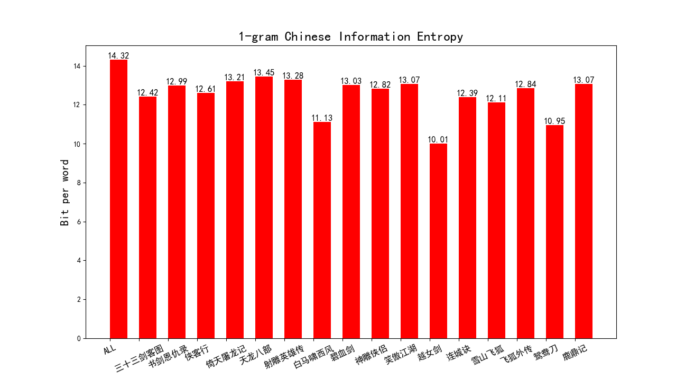
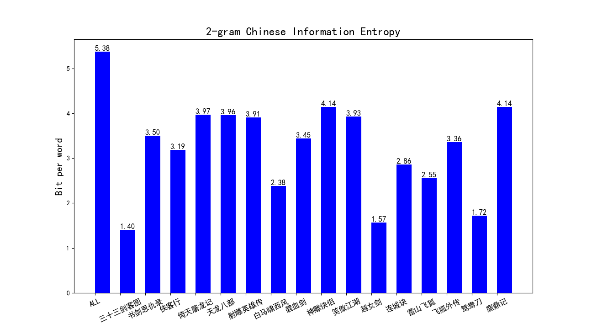
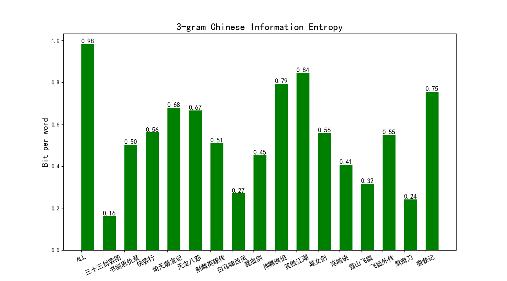

# 1. 环境配置

```python
conda create -n NLP_homework1 python=3.8
activate NLP_homework1

pip install numpy
pip install math
pip install jieba
pip install matplotlib
pip install logging
pip3 install multiprocessing
pip3 install opencc-python-reimplemented
```

# 2. 运行

```python
|--data/
|--util/
|   |——tools.py
|--CN_stopwords/
|   |--cn_stopwords.txt
|   |--cn_punctuation.txt
|--figs/
|--test.py
```


```python
cd ./NLP/Homework1/DLNLP2023
python test.py
```

# 3. 中文信息熵计算结果

|      |   小说名称   | 语料字数 | 分词个数 | 平均词长 | 1-gram  | 2-gram | 3-gram | Average Entropy | 平均运行时间 |
| :--: | :----------: | :------: | :------: | :------: | :-----: | :----: | :----: | :-------------: | :----------: |
|  1   | 三十三剑客图 |  27398   |  15523   |  1.7650  | 12.4196 | 1.4006 | 0.1607 |     4.6603      |   0.3092 s   |
|  2   |  书剑恩仇录  |  215458  |  215458  |  1.7841  | 12.9941 | 3.5019 | 0.5026 |     5.6662      |   2.2351 s   |
|  3   |    侠客行    |  138000  |  78317   |  1.7621  | 12.6135 | 3.1879 | 0.5604 |     5.4539      |   1.7394 s   |
|  4   |  倚天屠龙记  |  392821  |  219497  |  1.7896  | 13.2114 | 3.9723 | 0.6782 |     5.9540      |   4.1519 s   |
|  5   |   天龙八部   |  474427  |  267627  |  1.7727  | 13.4500 | 3.9611 | 0.6653 |     6.0255      |   5.5103 s   |
|  6   |  射雕英雄传  |  377964  |  212082  |  1.7822  | 13.2815 | 3.9054 | 0.5102 |     5.8990      |   4.0681 s   |
|  7   |  白马啸西风  |  25942   |  15084   |  1.7198  | 11.1289 | 2.3833 | 0.2703 |     4.5942      |   0.2802 s   |
|  8   |    碧血剑    |  203908  |  113788  |  1.7920  | 13.0251 | 3.4451 | 0.4520 |     5.6407      |   2.9422 s   |
|  9   |   神雕侠侣   |  402542  |  237730  |  1.6933  | 12.8229 | 4.1433 | 0.7912 |     5.9191      |   3.8287 s   |
|  10  |   笑傲江湖   |  369800  |  210133  |  1.7598  | 13.0726 | 3.9301 | 0.8444 |     5.9490      |   3.6403 s   |
|  11  |    越女剑    |   6924   |   4036   |  1.7156  | 10.0099 | 1.5652 | 0.5575 |     4.0442      |   0.0738 s   |
|  12  |    连城诀    |  87089   |  50135   |  1.7371  | 12.3949 | 2.8637 | 0.4076 |     5.2221      |   0.9475 s   |
|  13  |   雪山飞狐   |  52964   |  30345   |  1.7454  | 12.1144 | 2.5544 | 0.3165 |     4.9951      |   0.5276 s   |
|  14  |   飞狐外传   |  179486  |  100682  |  1.7827  | 12.8401 | 3.3577 | 0.5476 |     5.5818      |   1.7443 s   |
|  15  |    鸳鸯刀    |  14263   |   8271   |  1.7245  | 10.9532 | 1.7207 | 0.2418 |     4.3052      |   0.1396 s   |
|  16  |    鹿鼎记    |  471579  |  268857  |  1.7540  | 13.0667 | 4.1419 | 0.7544 |     5.9877      |   4.7403 s   |
|  17  |     ALL      | 3440565  | 1952872  |  1.7618  | 14.3238 | 5.3787 | 0.9819 |     6.8948      |  24.6830 s   |

# 4. 图片绘制

## 4.1   1-gram



## 4.2   2-gram



## 4.3   3-gram



## 4.4   Average-Entropy


# 5. 理论原理推导

## 5.1 信息熵

​		[熵](https://zh.wikipedia.org/wiki/熵_(信息论))在信息论中是接收的每条消息中包含的信息的平均量，又被称为信息熵、信源熵、平均自信息量。依据 Boltzmann’s H-theorem，香农把随机变量$X$的熵值$H$定义如下，其值域为$x_1,x_2,...,x_n$：
$$
\mathrm{H}(X)=\mathrm{E}[\mathrm{I}(X)]=\mathrm{E}[-\ln (\mathrm{P}(X))]
$$
​		其中，$P(X)$为 $X$的概率质量函数（probability mass function），$E$为期望函数，而$I(X)$是$X$的信息量（又称为自信息）。$I(X)$本身是个随机变量。

​		当取自有限的样本时，熵的公式可以表示为：
$$
\mathrm{H}(X)=\sum_i \mathrm{P}\left(x_i\right) \mathrm{I}\left(x_i\right)=-\sum_i \mathrm{P}\left(x_i\right) \log _b \mathrm{P}\left(x_i\right)
$$
​		在这里$b$是对数所使用的底，通常是 2, 自然常数 $e$，或是 10。当 $b=2$，熵的单位是 `bit`；当 $b=e$，熵的单位是 `nat`；而当 $b=10$，熵的单位是 `Hart`。

​		当$p_i=0$ 时，对于一些 $i$值，对应的被加数$0\times log_b0$的值将会是 0，与极限一致:
$$
\lim _{p \rightarrow 0+} p \log p=0
$$
​		还可以定义事件 $X$与$Y$分别取$x_i$和$y_j$时的条件熵为:
$$
\mathrm{H}(X \mid Y)=-\sum_{i, j} p\left(x_i, y_j\right) \log \frac{p\left(x_i, y_j\right)}{p\left(y_j\right)}
$$
​		其中$p(x_i,y_j)$为$X=x_i$且$Y=y_j$时的概率。这个量应当理解为知道$Y$的值前提下随机变量$X$的随机性的量。

## 5.2 分词模型

### 5.2.1  一元模型（1-gram）

$$
\mathrm{H}(\mathrm{X})=-\sum_{\mathrm{x} \in \mathrm{X}} \mathrm{p}(\mathrm{x}) \log \mathrm{p}(\mathrm{x})
$$

### 5.2.2  n元模型（n-gram）

​		将自然语言句子视作$N-1$阶马尔可夫模型，即规定句子中某词出现的概率只同它前面出现的$N-1$个词有关。常见的二元模型、三元模型：
$$
\begin{aligned}
&H(X \mid Y)=-\sum_{x \in X} \sum_{y \in Y} p(x, y) \log p(x \mid y)\\
&H(X \mid Y, Z)=-\sum_{x \in X} \sum_{y \in Y} \sum_{z \in Z} p(x, y, z) \log p(x \mid y, z)
\end{aligned}
$$
​		本文计算到3元模型，计算16本小说各自的1元、2元、3元信息熵，并计算其平均信息熵。

# 6. 参考链接

[参考链接1](https://kangleizhou.github.io/nlp/2021/04/08/Chinese_entropy/)

[参考链接2](https://blog.csdn.net/GWH_98/article/details/117001985)
