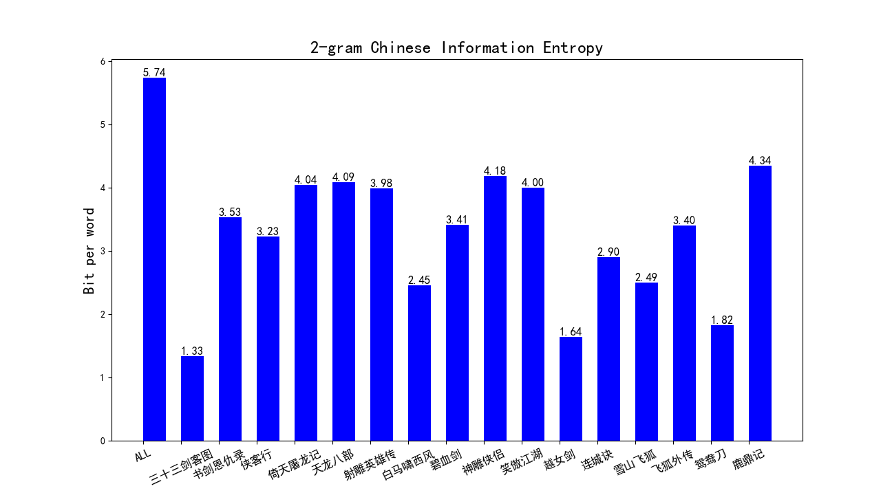
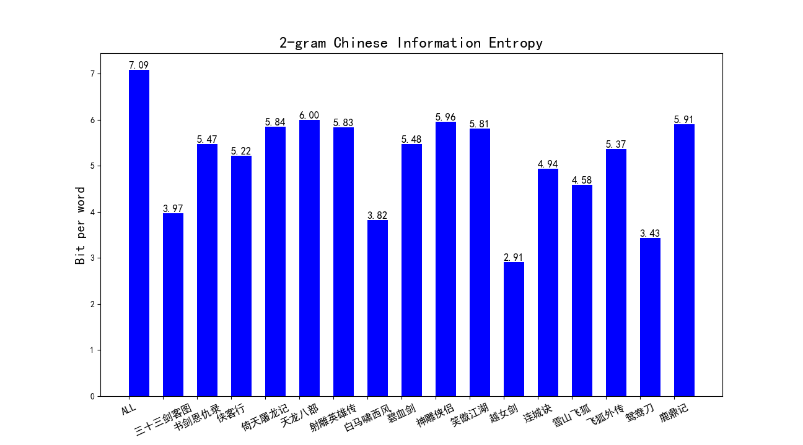

DLNLP_2023 第一次作业：计算**中文平均信息熵**

<font size = 5 color = "blue">ZY2203114 王彪 </font>

# 1. 环境配置

```python
conda create -n NLP_homework1 python=3.8
activate NLP_homework1

pip install numpy
pip install math
pip install jieba
pip install matplotlib
pip install logging
pip3 install multiprocessing
pip3 install opencc-python-reimplemented
```

# 2. 运行

```python
|--data/
|--util/
|   |——tools.py
|--CN_stopwords/
|   |--cn_stopwords.txt
|   |--cn_punctuation.txt
|--figs/
|--test.py
|--ZY2203114-Report.pdf
|--运行记录_最最最最最新再也不改版.txt
```


```python
cd ./NLP/Homework1/DLNLP2023
python test.py
```

# 3. 算法流程

1. 预处理并保存文件，去除stopwords

```python
def SentencePreprocessing():
    line = ''
    data_txt, filenames = read_data(data_dir='./data')
    len_data_txt = len(data_txt)
    punctuations = stop_punctuation('./CN_stopwords/cn_stopwords.txt')  # 停词
# 省略
```

2. jieba分词（区分以词与以字为单位）

```python
def get_split_words(file_path,flag):
    with open(file_path, 'r', encoding='utf-8') as f:
        corpus = []
        split_words = []
        count = 0
        for line in f:
            if line != '\n':
                corpus.append(line.strip())
                count += len(line.strip())

        corpus = ''.join(corpus)
        if flag is False:
            split_words = list(jieba.cut(corpus))  # 利用jieba分词
        elif flag is True:
            split_words = [x for x in corpus]
    return split_words,len(corpus)
```

3. 计算词频

```python
# 一元模型词频统计
def get_unigram_tf(tf_dic, words):
    for i in range(len(words)-1):
        tf_dic[words[i]] = tf_dic.get(words[i], 0) + 1
```

```python
# 二元模型词频统计
def get_bigram_tf(tf_dic, words):
    for i in range(len(words)-1):
        tf_dic[(words[i], words[i+1])] = tf_dic.get((words[i], words[i+1]), 0) + 1
```

```python
# 三元模型词频统计
def get_trigram_tf(tf_dic, words):
    for i in range(len(words)-2):
        tf_dic[((words[i], words[i+1]), words[i+2])] = tf_dic.get(((words[i], words[i+1]), words[i+2]), 0) + 1
```

4. 计算信息熵（以一元模型为例）

```python
# 计算一元模型信息熵
def calculate_unigram_entropy(file_path,words_tf,len_):
    before = time.time()

    begin = time.time()
    words_num = sum([item[1] for item in words_tf.items()])
    logging.info(file_path)
    print("分词个数：{}".format(words_num))
    print('分词种类数：{}'.format((len(words_tf))))
    print("平均词长：{:.4f}".format(len_ / float(words_num)))

    entropy = 0
    for item in words_tf.items():
        entropy += -(item[1] / words_num) * math.log(item[1] / words_num, 2)
    print("基于词的一元模型中文信息熵为：{:.4f} 比特/词".format(entropy))

    end = time.time()
    runtime = round(end - before, 4)
    print("一元模型运行时间：{:.4f} s".format(runtime))
    return entropy
```

5. 绘图

```python
def draw_results(data,novel_name,color,title,path):  # 画柱状图
    length = len(data)
    x = np.arange(length)
    plt.figure(figsize=(12.96, 7.2))
    width = 0.6  # 单个柱状图的宽度
    x1 = x + width / 2  # 第一组数据柱状图横坐标起始位置
    plt.title(title, fontsize=18)  # 柱状图标题
    plt.ylabel("Bit per word", fontsize=15)  # 纵坐标label
    plt.bar(x1, data, width=width, color=color)
    plt.xticks(x, novel_name, rotation=25, fontsize=12)
    for a, b in zip(x1, data):  # 柱子上的数字显示
        plt.text(a, b, '%.2f' % b, ha='center', va='bottom', fontsize=12)
    # plt.legend()  # 给出图例
    # plt.show()
    plt.savefig(path)
```


# 4. 中文信息熵计算结果

+ **==以下仅作记录参考，具体运行结果见 <u>./运行记录_最最最最最新再也不改版.txt</u>==**

## 4.1 以词为单位(使用jieba.cut)

|      |   小说名称   |  语料字数   | 1-gram分词种类数 | 1-gram平均词长 | 1-gram信息熵 | 2-gram分词种类数 | 2-gram平均词长 | 2-gram信息熵 | 3-gram分词种类数 | 3-gram平均词长 | 3-gram信息熵 | Average Entropy |
| :--: | :----------: | :---------: | :--------------: | :------------: | :----------: | :--------------: | :------------: | :----------: | :--------------: | :------------: | :----------: | :-------------: |
|  1   | 三十三剑客图 |    27398    |       8425       |     1.8942     |   12.4196    |      14057       |     3.3165     |    1.4006    |      14368       |     3.8957     |    0.1607    |     4.6603      |
|  2   |  书剑恩仇录  |   215458    |      33345       |     1.8919     |   12.9941    |      102998      |     3.3751     |    3.5019    |      112828      |     3.8923     |    0.5026    |     5.6662      |
|  3   |    侠客行    |   138000    |      22964       |     1.8788     |   12.6135    |      65764       |     3.3832     |    3.1879    |      72329       |     3.8807     |    0.5604    |     5.4539      |
|  4   |  倚天屠龙记  |   392821    |      50580       |     1.8960     |   13.2114    |      180007      |     3.3142     |    3.9723    |      204110      |     3.8973     |    0.6782    |     5.9540      |
|  5   |   天龙八部   |   474427    |      60545       |     1.8845     |   13.4500    |      219292      |     3.3811     |    3.9611    |      247541      |     3.8871     |    0.6653    |     6.0255      |
|  6   |  射雕英雄传  |   377964    |      50881       |     1.8983     |   13.2815    |      176327      |     3.4100     |    3.9054    |      197050      |     3.8990     |    0.5102    |     5.8990      |
|  7   |  白马啸西风  |    25942    |       5772       |     1.8670     |   11.1289    |      12914       |     3.5787     |    2.3833    |      13820       |     3.8674     |    0.2703    |     4.5942      |
|  8   |    碧血剑    |   203908    |      32668       |     1.9016     |   13.0251    |      96933       |     3.3243     |    3.4451    |      106247      |     3.9035     |    0.4520    |     5.6407      |
|  9   |   神雕侠侣   |   402542    |      52217       |     1.7951     |   12.8229    |      187089      |     2.9787     |    4.1433    |      215194      |     3.8185     |    0.7912    |     5.9191      |
|  10  |   笑傲江湖   |   369800    |      48065       |     1.9002     |   13.0726    |      166367      |     3.4234     |    3.9301    |      190108      |     3.9033     |    0.8444    |     5.9490      |
|  11  |    越女剑    |    6924     |       1972       |     1.8439     |   10.0099    |       3473       |     3.3353     |    1.5652    |       3708       |     3.8452     |    0.5575    |     4.0442      |
|  12  |    连城诀    |    87089    |      16172       |     1.8542     |   12.3949    |      43149       |     3.4111     |    2.8637    |      46575       |     3.8557     |    0.4076    |     5.2221      |
|  13  |   雪山飞狐   |    52964    |      11309       |     1.8577     |   12.1144    |      26389       |     3.3049     |    2.5544    |      28009       |     3.8577     |    0.3165    |     4.9951      |
|  14  |   飞狐外传   |   179486    |      28087       |     1.8921     |   12.8401    |      85512       |     3.3485     |    3.3577    |      93739       |     3.8931     |    0.5476    |     5.5818      |
|  15  |    鸳鸯刀    |    14263    |       3784       |     1.8635     |   10.9532    |       7262       |     3.4813     |    1.7207    |       7607       |     3.8633     |    0.2418    |     4.3052      |
|  16  |    鹿鼎记    |   471579    |      55751       |     1.8741     |   13.0667    |      211499      |     3.4972     |    4.1419    |      246776      |     3.8793     |    0.7544    |     5.9877      |
|  **  |   **ALL**    | **3440565** |      273057      |     1.8768     | **14.3238**  |     1459121      |     3.3387     |  **5.7377**  |     1788317      |     3.8838     |  **0.6441**  |   **6.9019**    |

## 4.2 以字为单位（不使用jieba）

| #    |   小说名称   |  语料字数   | 1-gram模型信息熵 | 2-gram信息熵 | 3-gram信息熵 | Average Entropy |
| ---- | :----------: | :---------: | :--------------: | ------------ | :----------: | :-------------: |
| 1    | 三十三剑客图 |    27398    |     10.0503      | 3.4441       |    0.7263    |     4.7402      |
| 2    |  书剑恩仇录  |   215458    |      9.8583      | 4.6374       |    1.8821    |     5.4593      |
| 3    |    侠客行    |   138000    |      9.5035      | 4.4237       |    1.8183    |     5.2485      |
| 4    |  倚天屠龙记  |   392821    |      9.7706      | 5.0116       |    2.1675    |     5.6499      |
| 5    |   天龙八部   |   474427    |      9.8887      | 5.0866       |    2.1783    |     5.7179      |
| 6    |  射雕英雄传  |   377964    |      9.8168      | 4.9754       |    2.1798    |     5.6573      |
| 7    |  白马啸西风  |    25942    |      9.1982      | 3.0427       |    1.3212    |     4.5207      |
| 8    |    碧血剑    |   203908    |      9.8010      | 4.7115       |    1.7905    |     5.4343      |
| 9    |   神雕侠侣   |   402542    |      9.6743      | 5.1705       |    2.1787    |     5.6745      |
| 10   |   笑傲江湖   |   369800    |      9.6102      | 4.9143       |    2.1251    |     5.5499      |
| 11   |    越女剑    |    6924     |      8.6164      | 2.4000       |    0.9969    |     4.0044      |
| 12   |    连城诀    |    87089    |      9.5919      | 4.1782       |    1.5627    |     5.1109      |
| 13   |   雪山飞狐   |    52964    |      9.5337      | 3.8860       |    1.3864    |     4.9354      |
| 14   |   飞狐外传   |   179486    |      9.6787      | 4.5618       |    1.8642    |     5.3682      |
| 15   |    鸳鸯刀    |    14263    |      9.2049      | 2.7862       |    0.9888    |     4.3266      |
| 16   |    鹿鼎记    |   471579    |      9.7428      | 4.9523       |    2.2457    |     5.6469      |
| **   |   **ALL**    | **3440565** |   **10.0916**    | **7.0873 **  |  **3.2491**  |   **6.8094**    |

# 5. 图片绘制

## 5.1 以词为单位

### 5.1.1   1-gram-byword


### 5.1.2   2-gram-byword



### 5.1.3   3-gram-byword


### 5.1.4   Average-Entropy-byword


## 5.2 以字为单位

### 5.2.1   1-gram-bychar


### 5.2.2   2-gram-bychar



### 5.2.3   3-gram-bychar


### 5.2.4   Average-Entropy-bychar


# 6. 理论原理推导

## 6.1 信息熵

​		[熵](https://zh.wikipedia.org/wiki/熵_(信息论))在信息论中是接收的每条消息中包含的信息的平均量，又被称为信息熵、信源熵、平均自信息量。依据 Boltzmann’s H-theorem，香农把随机变量$X$的熵值$H$定义如下，其值域为$x_1,x_2,...,x_n$：
$$
\mathrm{H}(X)=\mathrm{E}[\mathrm{I}(X)]=\mathrm{E}[-\ln (\mathrm{P}(X))]
$$
​		其中，$P(X)$为 $X$的概率质量函数（probability mass function），$E$为期望函数，而$I(X)$是$X$的信息量（又称为自信息）。$I(X)$本身是个随机变量。

​		当取自有限的样本时，熵的公式可以表示为：
$$
\mathrm{H}(X)=\sum_i \mathrm{P}\left(x_i\right) \mathrm{I}\left(x_i\right)=-\sum_i \mathrm{P}\left(x_i\right) \log _b \mathrm{P}\left(x_i\right)
$$
​		在这里$b$是对数所使用的底，通常是 2, 自然常数 $e$，或是 10。当 $b=2$，熵的单位是 `bit`；当 $b=e$，熵的单位是 `nat`；而当 $b=10$，熵的单位是 `Hart`。

​		当$p_i=0$ 时，对于一些 $i$值，对应的被加数$0\times log_b0$的值将会是 0，与极限一致:
$$
\lim _{p \rightarrow 0+} p \log p=0
$$
​		还可以定义事件 $X$与$Y$分别取$x_i$和$y_j$时的条件熵为:
$$
\mathrm{H}(X \mid Y)=-\sum_{i, j} p\left(x_i, y_j\right) \log \frac{p\left(x_i, y_j\right)}{p\left(y_j\right)}
$$
​		其中$p(x_i,y_j)$为$X=x_i$且$Y=y_j$时的概率。这个量应当理解为知道$Y$的值前提下随机变量$X$的随机性的量。

## 6.2 分词模型

### 6.2.1  一元模型（1-gram）

$$
\mathrm{H}(\mathrm{X})=-\sum_{\mathrm{x} \in \mathrm{X}} \mathrm{p}(\mathrm{x}) \log \mathrm{p}(\mathrm{x})
$$

### 6.2.2  n元模型（n-gram）

​		将自然语言句子视作$N-1$阶马尔可夫模型，即规定句子中某词出现的概率只同它前面出现的$N-1$个词有关。常见的二元模型、三元模型：
$$
\begin{aligned}
&H(X \mid Y)=-\sum_{x \in X} \sum_{y \in Y} p(x, y) \log p(x \mid y)\\
&H(X \mid Y, Z)=-\sum_{x \in X} \sum_{y \in Y} \sum_{z \in Z} p(x, y, z) \log p(x \mid y, z)
\end{aligned}
$$
​		本文计算到3元模型，计算16本小说各自的1元、2元、3元信息熵，并计算其平均信息熵。

# 7. 结论

1. **存在的问题**：本程序计算语料字数、分词个数与参考资料有些出入，分析原因，语料字数是因为导入停词文件导致，分词个数应是程序编写的bug。
2. **中英文对比**：本实验中计算出在分词模式下，一元词的信息熵为**14.3238**，在字符模式下，单个字的信息熵为**10.0916**，而论文中提出的模型计算出的英文单个词信息熵为**1.75**，这一点说明，无论是以字为单位还是词为单位，中文的信息熵都要比英文高，即中文混乱程度更高，包含的信息量也更多。
3. **n-gram对比**：在分词模式下，一元词的信息熵为**14.3238**，二元词的信息熵为**5.7377**，三元词的信息熵为**0.6441**，可以看出随着N的增大，平均信息熵在下降，这是因为N取值越大，通过分词后得到的文本中词组的分布就越简单，N越大使得固定的词数量越多，固定的词能减少由字或者短词打乱文章的机会，使得文章变得更加有序，减少了由字组成词和组成句的不确定性，也即减少了文本的信息熵，符合实际认知。但在分字符模式下，一元字符的信息熵为**10.0916**，二元字符的信息熵为**7.0873**，三元字符的信息熵为**3.2491**，也符合上述规律。
4. **两种模式对比**：分词模式在一元和二元下得到的信息熵比分字符模式更高，而在三元时得到的信息熵比分字符模式更低，由分词个数我们可以发现其背后的原因，在分词模式下，一元词的数目远大于一元字符的数目，这是由于不同字符组合成词的方式非常多样，这就导致了词这一单位信息熵的增大，而当N增大时，由于词与词之间常常有一些固定的组合搭配，会形成一些固定的意思，这就使得整体的信息熵降了下来，而对于字符，虽然也有同样的趋势，字符间的组合往往比词语的组合要更加随机，因此在三元时，分字符模式的信息熵要比分词模式高。

# 8. 参考链接

[参考链接1](https://kangleizhou.github.io/nlp/2021/04/08/Chinese_entropy/)

[参考链接2](https://blog.csdn.net/GWH_98/article/details/117001985)

[参考链接3](https://github.com/NSun-S/buaa_nlp_project1)
